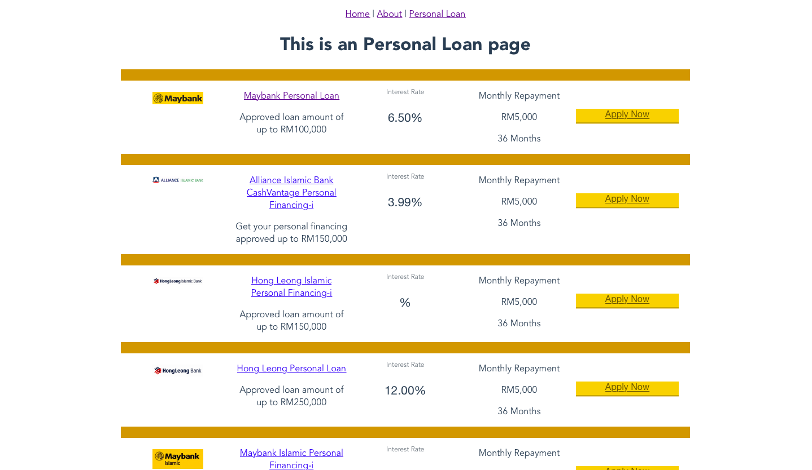
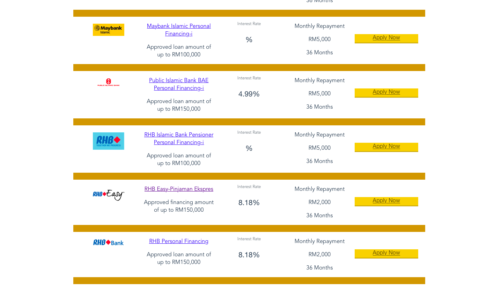

# Lead App
Frontend: VueJS
Backend: ExpressJS
Database: MongoDB
Memory: Redis

# Goal 1

Status: completed

# Goal 2

Status: completed

# Goal 3

status: completed

screens:

# Installation
backend
npm install

# Start
npm start

cd frontend
npm install
npm run serve